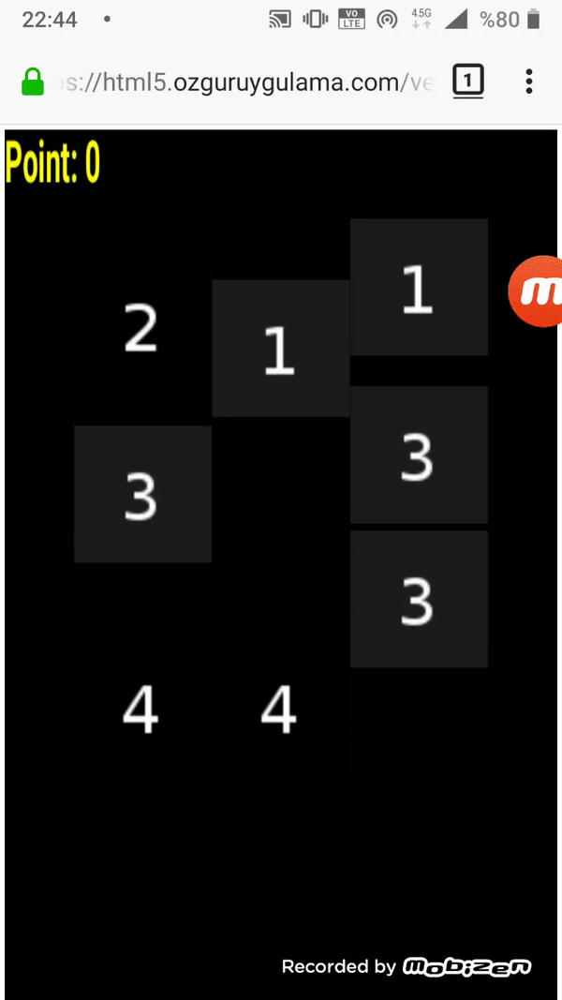

### Vectorial Numbers

the 3th game trying with Phaser 3

**used**

`sprite.setInteractive()`
`.setTexture`
`this.input.on("gameobjectdown", fx, this)`
`spritesheet`

### Resized sprites with the real ratios in dynamic Canvas sizes:

   `this.canvas = this.sys.game.canvas;
				this._width = this.canvas.offsetWidth;
				this._height = this.canvas.offsetHeight;
				this.__column_number = this.__level_column_numbers[this.__level];
				this.__column_width_spar = this.__level_column_width_spars[this.__level];
				this.__sprite_w = 64;
				this.__sprite_h = 64;
				this.__gap = this._width/(this.__column_number + 1);
				this.__sprite_w_scale = this.__gap/(this._width*64/800);
				this.__sprite_h_scale = this.__gap/(this._height*64/600);`
        
        with this ratio:
        `sprite.setScale(this.__sprite_w_scale, this.__sprite_h_scale);`
	
	
## [Facebook instant games](https://apps.facebook.com/480683482787818 "Facebook instant games")

## [Demo](https://html5.ozguruygulama.com/vectorial_numbers/index.html "Demo")
